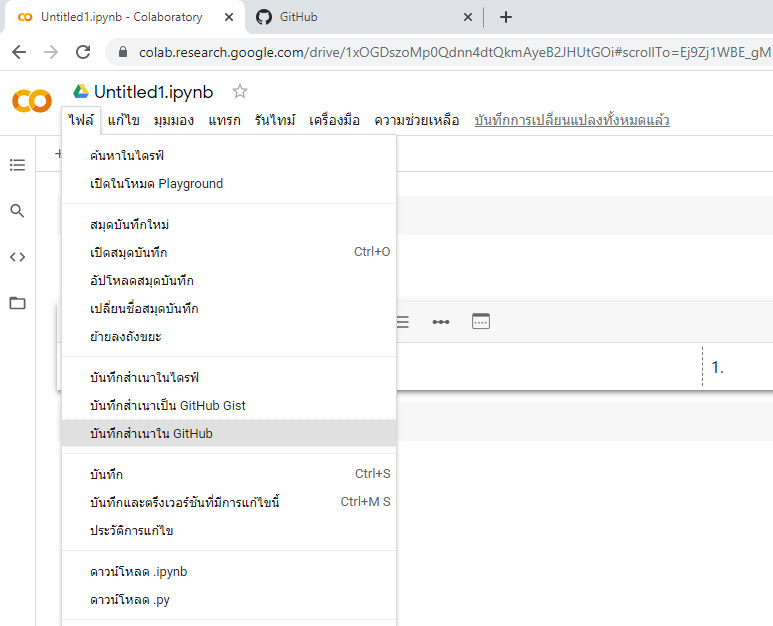
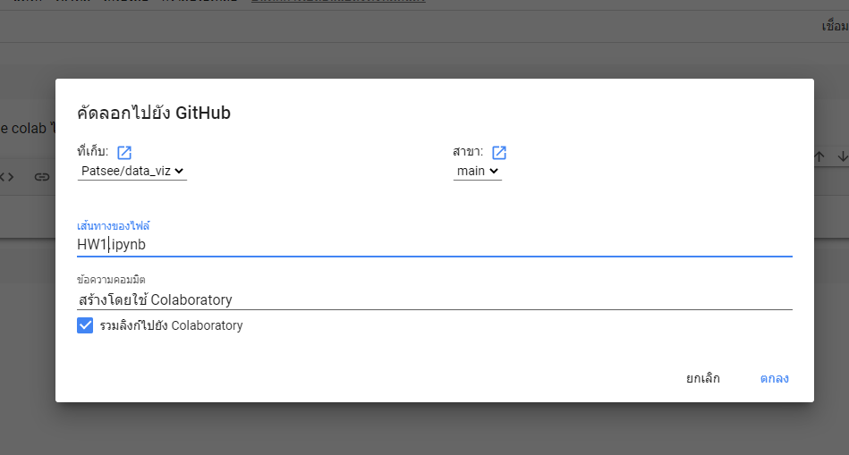

# data_viz

พัสกร  ปัดสี  613020194-6

ตัวอย่างการแทรกรูป

วิธีบันทึกจาก Google colab ไปยัง Github

1. คลิกคำสั่ง "ไฟล์" แล้วเลือกคำสั่งว่า "บันทึกสำเนาใน Githud" ตามลำดับ

2.หลังจากเลือกคำสั่ง "บันทึกสำเนาใน Github" ให้เปลี่ยนชื่อไฟล์ตามงานต่าง ๆ โดยเก็บไว้ใน data_viz ดังรูปภาพ แล้วคลิก ตกลง

